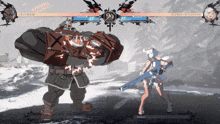

<h1 align="center">Hi 👋, I'm Punnavit Sirinan</h1>
<h3 align="center">A passionate student from KOSEN-KMITL</h3>

- 🌱 I’m currently learning at **KOSEN-KMITL**

- 📫 How to reach me **67991017@kmitl.ac.th**

- ⚡ Fun fact **I like Potemkin Buster**

<h3 align="left">Connect with me:</h3>

<h3 align="left">Languages and Tools:</h3>

      

  

&nbsp;

